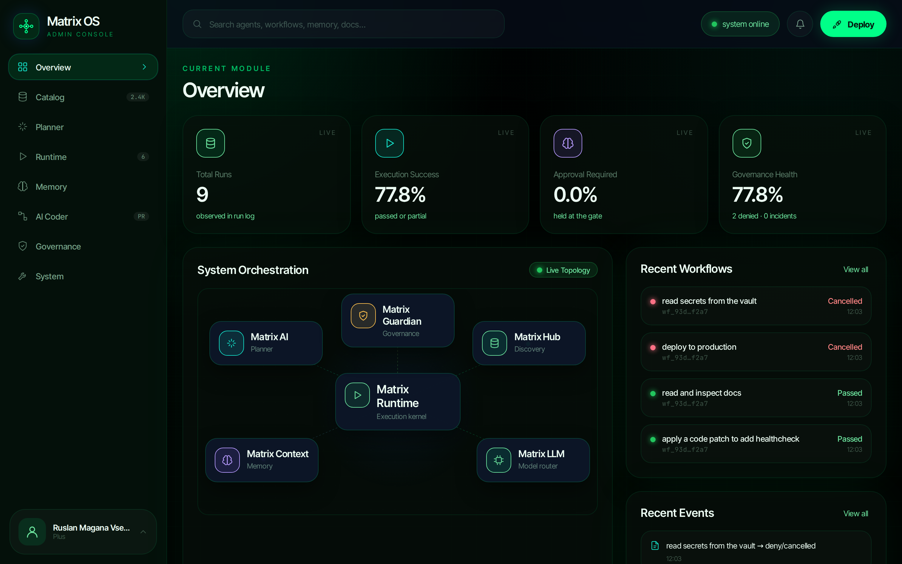
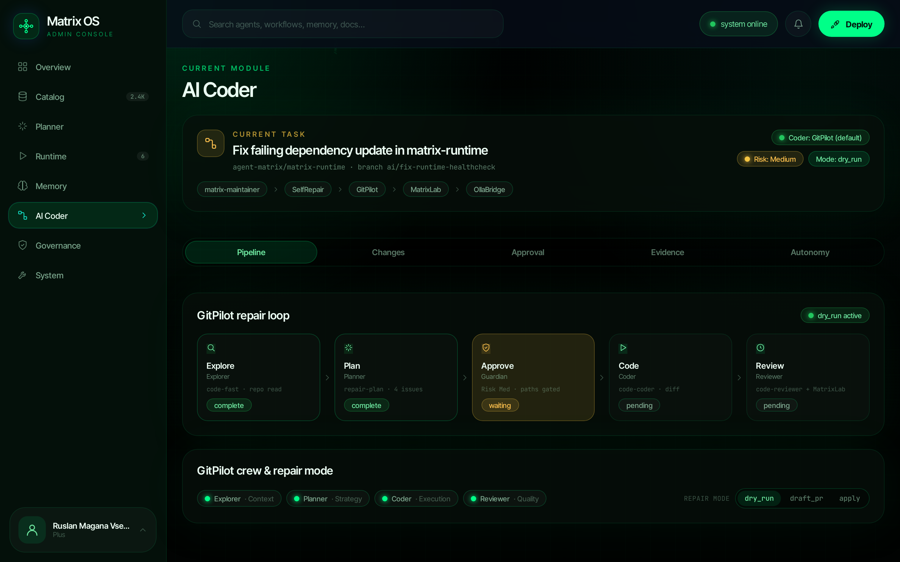

<p align="center">
  
</p>

<p align="center">
  <b>The governed-autonomy operating system for the Agent-Matrix ecosystem.</b><br/>
  An enterprise control plane that turns a goal into auditable, human-controlled action.
</p>

<p align="center">
  <a href="https://github.com/agent-matrix/matrix-os/actions/workflows/integration.yml"></a>
  <a href="LICENSE"></a>
  <a href="pyproject.toml"></a>
  <a href="tests/"></a>
  
</p>

<p align="center">
  
  <br/><sub>The Matrix OS Admin Command Center — live governed-autonomy telemetry.</sub>
</p>

---

> **The premise:** the first safe superintelligence will not be an unconstrained
> model — it will be a *governed system*: auditable, corrigible, and always under
> human authority. Matrix OS is the control plane that makes the Agent-Matrix
> superintelligence stack safe to operate, scale, and sell into the enterprise.

<p align="center">
  
</p>

Matrix OS composes the independent Matrix services — Hub, AI, Guardian, Treasury,
Context, MatrixLab, Runtime, and **GitPilot** — into one disciplined loop where
every effectful action flows through a versioned contract, is scored by policy,
funded by a budget, run in a sandbox, proven with an evidence bundle, and
remembered.

```
Observe → Remember → Plan → Govern → Fund → Execute → Verify → Record → Learn
```

> **Status (honest):** v0.1 ships the **governed-autonomy kernel** — the full loop,
> the policy engine, the contracts, the GitPilot AI-coder integration, the eval
> harness, and the admin console — implemented in-process and covered by 36 tests.
> Live service wiring and the enterprise deployment overlays are on the
> [roadmap](docs/roadmap.md); each is marked below so claims stay precise.

---

## Why governed autonomy

Autonomous agents are easy to demo and hard to *trust*. Matrix OS provides the
missing discipline: **separation of authority**, enforced by the kernel.

| Component | Authority | Never |
|---|---|---|
| Matrix AI | proposes plans | executes |
| Matrix Guardian | decides what is **allowed** | writes code |
| Matrix Treasury | decides what is **affordable** | grants itself budget |
| **GitPilot** | writes code (the default AI coder) | runs unapproved |
| MatrixLab | verifies in isolated sandboxes | sees production secrets |
| Matrix Context | remembers and explains | acts |
| **Humans** | retain authority over high-risk actions | — |

No component grants itself permission. The kernel is **fail-closed**: unknown
capabilities are treated as high risk, denylisted commands trigger an emergency
stop, secrets are never passed to sandboxes, and high-risk plans are held at the
human approval gate by default.

---

## Built for the enterprise

| Capability | What it means | Status |
|---|---|---|
| **Auditable by construction** | every run emits an immutable evidence bundle (plan, logs, diff, tests, policy report) | ✅ implemented |
| **Human-in-the-loop** | high-risk actions require explicit approval; emergency stop disables all effectful work | ✅ implemented |
| **Policy-as-code** | governance is versioned YAML (constitution, risk matrix, capabilities, denylist) | ✅ implemented |
| **Contract-first integration** | JSON Schemas at every boundary; services evolve independently | ✅ implemented |
| **Safe AI code changes** | code work is delegated to GitPilot, dry-run first, sandbox-verified, path-gated | ✅ implemented |
| **Secrets discipline** | model credentials live only in the gateway; the kernel never carries `HF_TOKEN` | ✅ by design |
| **On-prem / hybrid / air-gapped** | local-first model routing; no data egress by default | 🟡 roadmap (overlays) |
| **RBAC, SSO, multi-tenant** | operator roles, SSO-ready admin, tenant isolation | 🟡 roadmap |
| **SBOM & provenance** | signed manifests and supply-chain attestation | 🟡 roadmap |

---

## Quickstart

```bash
make install      # create .venv and install (uv when available — fast)
make test         # run the test suite (36 tests)
make run          # start the backend API + console → http://localhost:8080
```

`make run` serves the **Admin Console and the backend API together** (same origin,
live data) and walks up to the next free port if 8080 is taken.

Drive the governed-autonomy loop directly:

```bash
matrix-os run "read and inspect the repository"      # allow   → passed
matrix-os run "apply a code patch and run tests"     # sandbox → passed
matrix-os run "deploy to production"                 # deny    → cancelled (blocked)

matrix-os policy "deploy to production"              # decision only, no execution
matrix-os doctor                                     # effective safety config + services
```

> `make` builds an isolated `.venv` and installs with [`uv`](https://docs.astral.sh/uv/)
> when present, falling back to `pip` — a clean checkout works with no global setup.

---

## The kernel

The `matrix_os/` package implements the loop in-process with replaceable
components, so live services attach without rewriting the control flow.

| Stage | Module | Contract emitted |
|---|---|---|
| Plan | `planner.py` | [`plan-ir`](contracts/plan-ir.schema.json) |
| Govern | `governance.py` · `policy.py` | [`policy-grant`](contracts/policy-grant.schema.json) |
| Fund | `treasury.py` | [`budget-grant`](contracts/budget-grant.schema.json) |
| Execute | `executor.py` | step results |
| Verify | `verifier.py` | [`evidence-bundle`](contracts/evidence-bundle.schema.json) |
| Remember / Learn | `memory.py` | [`memory-event`](contracts/memory-event.schema.json) |

### CLI

| Command | Purpose |
|---|---|
| `matrix-os run "<goal>" [--approve] [--repo URL --path P]` | Run the full governed loop; `--repo` delegates code steps to GitPilot (dry-run). |
| `matrix-os policy "<goal>"` | Show the governance decision without executing. |
| `matrix-os coder health \| dry-run` | Exercise the GitPilot AI-coder boundary. |
| `matrix-os serve [--host --port]` | Serve the console + backend API (auto port fallback). |
| `matrix-os eval` / `metrics` / `dashboard` | Eval suite / run metrics / console data snapshot. |
| `matrix-os validate` / `doctor` | Self-check contracts / report config. |

Backend API (via `matrix-os serve`): `GET /data.json`, `GET /api/health`,
`GET /api/metrics`, `POST /api/run {goal}`.

---

## AI coder — GitPilot (default)

Matrix OS does not implement its own code writer. The default AI coder is
**GitPilot** (`ruslanmv/gitpilot`): code generation has exactly one path, and it
is *integrated, never replaced*. A code-writing step (`fs.apply_patch`) is
delegated to GitPilot's `POST /repair` **only after Guardian grants the
capability**, and always in **dry-run** mode in the gated loop — MatrixLab
verifies the result.

See **[ADR 0001](docs/adr/0001-gitpilot-default-coder.md)** and the full
**[AI coder workflow](docs/ai-coder-workflow.md)** (cast, 12-step repair flow,
`dry_run`/`draft_pr`/`apply` modes, fail-closed rules, OllaBridge-only model
access). The `repair-plan` ↔ `repair-response` contracts are enforced and tested.

---

## Admin console

`frontend/` is the **Matrix OS Admin Command Center** — a static, no-build
single-page console (Matrix-film phosphor-green, cinematic digital rain, live
hub-and-spoke topology). It visualises the kernel: Overview metrics, the **AI
Coder** GitPilot repair loop, the evidence bundle, the autonomy rollout, and
System settings.

<p align="center">
  
  <br/><sub>AI Coder — the GitPilot repair loop (Explore → Plan → Approve → Code → Review), dry-run by default.</sub>
</p>

```bash
make run                 # serve console + live backend API (auto port fallback)
bash frontend/serve.sh   # static only; then `matrix-os dashboard` to snapshot data
```

Served via `make run`, the console fetches `/data.json` from the backend, so it
always shows **live** kernel data — no extra step.

---

## Contracts

Explicit JSON Schemas let every service evolve independently. All are validated
by `matrix-os validate` and in CI.

| Contract | Purpose |
|---|---|
| `plan-ir` | Structured plan from Matrix AI. |
| `policy-grant` | Guardian's decision and granted capabilities. |
| `budget-grant` | Treasury's spend/runtime limits. |
| `evidence-bundle` | Logs, artifacts, and proofs emitted after execution. |
| `memory-event` | Typed, scoped write into the memory plane. |
| `agent-card` | Agent identity, capabilities, and safety profile. |
| `repair-plan` / `repair-response` | The SelfRepair ↔ GitPilot AI-coder boundary. |
| `eval-report` | Output of the behavioural eval suite. |

---

## Governance & safety

Governance is a safety **constitution** plus executable **policies**
(`policies/`). The engine maps every plan to exactly one decision:

```
allow · allow_with_limits · require_sandbox · require_human_approval · deny · emergency_stop
```

Defaults are secure: shell is denied unless capability-granted, secrets never
reach sandboxes, network is off in sandbox mode, self-modification is PR-only,
every run emits evidence, and an emergency stop can disable all effectful
workflows. See [governance kernel](docs/governance-kernel.md) and the
[safety constitution](docs/safety-constitution.md).

---

## Project layout

```text
matrix-os/
├── matrix_os/            # the kernel package
│   ├── kernel.py         # the governed-autonomy loop
│   ├── policy.py         # fail-closed policy engine
│   ├── planner.py governance.py treasury.py executor.py verifier.py
│   ├── memory.py         # memory plane + learning from outcomes
│   ├── server.py         # backend API + static console (one origin)
│   ├── contracts.py http_client.py dashboard.py metrics.py evals.py cli.py
│   └── adapters/         # service seams: base · http · gitpilot · context
├── contracts/            # JSON Schemas (the wire contracts)
├── policies/             # executable governance
├── workflows/  agents/   # workflow definitions + agent-role manifests
├── evals/                # behavioural eval suite
├── frontend/             # Admin Command Center (static SPA)
├── assets/               # brand (logo.svg, logo-mark.svg)
├── compose/  k8s/        # deployment profiles
├── docs/                 # architecture, governance, memory, ADRs
├── tests/                # pytest suite
├── Makefile  pyproject.toml
```

---

## Development

| Target | Action |
|---|---|
| `make install` | Create `.venv`, install kernel + dev deps (uv if available, else pip). |
| `make run` | Start the backend API + console (`PORT`/`HOST` overridable, auto fallback). |
| `make goal GOAL="…"` | Run the governed loop once for a goal. |
| `make test` | Run the test suite. |
| `make validate` / `make eval` / `make evals` | Contracts / eval suite / full CI parity. |
| `make dashboard` | Refresh `frontend/data.json` for static hosting. |
| `make clean` / `make distclean` | Remove caches+state / also remove `.venv`. |

Runtime state (`.matrix/`), the virtualenv (`.venv/`), and build artifacts are
git-ignored.

---

## Documentation

- [Architecture](docs/architecture.md) · [Execution loop](docs/execution-loop.md)
- [Governance kernel](docs/governance-kernel.md) · [Safety constitution](docs/safety-constitution.md)
- [Memory system](docs/memory-system.md)
- [AI coder workflow](docs/ai-coder-workflow.md) · [ADR 0001 — GitPilot default coder](docs/adr/0001-gitpilot-default-coder.md)
- [Roadmap](docs/roadmap.md)

### Research

The Matrix BIOS research — the paper, models, benchmarks, datasets, and training
toolkit — lives in its own repository:
**[agent-matrix/matrix-research](https://github.com/agent-matrix/matrix-research)**.

---

## License

[Apache-2.0](LICENSE), unless a referenced upstream component states otherwise.

<p align="center"><sub>Matrix OS — governed autonomy for the Agent-Matrix superintelligence stack.</sub></p>
